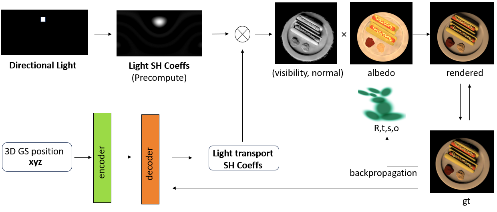

<div align="center">
<h2>Light Transport Gaussian: Relighting 3D Gaussians Based on Precomputed Radiance Transfer</h2>

[**Libo Zhang**](https://zhanglbthu.github.io/) · [**Yuxuan Han**](https://yxuhan.github.io/) · [**Wenbin Lin**](https://wenbin-lin.github.io/) · [**Jingwang Ling**](https://gerwang.github.io/) · [**Feng Xu**](http://xufeng.site/)

Tsinghua University

</div>

### [Project Page]() | [Paper]() | [Video]() | [Dataset]()
### Abstract
This work presents Light Transport Gaussian, a method for achieving high-quality real-time relighting from a multi-view, multi-illumination dataset.
We use 3D Gaussians to represent the geometry of general objects. For each Gaussian we additionally optimize an albedo term and use a network to estimate the SH coefficients of its light transport. 
We then dot-multiply the albedo, the SH coefficients of the light transport, and the SH coefficients of the light source to get the final color for each Gaussian. The final image is rendered bt Splatting.
Experiments demonstrate that our method achieves good results in terms of quality and speed of relighting.

### Pipeline


### Video

## Usage

### Setup

```bash
git clone git@github.com:zhanglbthu/Light-Transport-Gaussian.git
cd Light-Transport-Gaussian
conda create -n LTG python=3.7
conda activate LTG
pip install -r requirements.txt
```

### Dataset
We train the model using a dataset in the form of **LIGHT STAGE**, where the information about the camera and light source is known, specifically, the object is NeRF synthetic data and the light source is directional light.
You can download the generated dataset form [here](https://drive.google.com/drive/folders/1j4YlmIpuZZjyrXb4QxSI86ZgrIfP6mCr?usp=drive_link).
### Preprocess your own dataset
You can also preprocess your own dataset by following the steps below:
1. Download the data preprocessing code from [here](https://drive.google.com/drive/folders/1AiOE_F0imYrxqABN2BVy4On0BxnjbDgV?usp=sharing).
2. Modify the data configuration file `config/data.ini` to fit your own dataset.
3. Modify and run the bash script `bash/get_data.sh` 
### Train
You can download our trained model from [here](https://drive.google.com/drive/folders/1g4r1g_39yXL071Co9uQ7fgqEPaHgfO8B?usp=drive_link).
You can also train your own model by following the steps below:

First, modify the training configuration file `config/optimize.ini` to fit your own dataset.

**Arguments**:
- `root_path`: the root path of the dataset.
- `obj_name`: the name of the object.
- `out_name`: the name of the output folder.
- `data_type`: the type of the dataset, `NeRF` or `OpenIllumination`.

Then, run the training script:
```bash
bash bash/run_single.bash
```
### Test
We provide scripts for testing the relighting results of the trained model on the test set.
Similarly, modify the testing configuration file `config/evaluate.ini` and run the testing script:
```bash
bash bash/eval.bash
```
