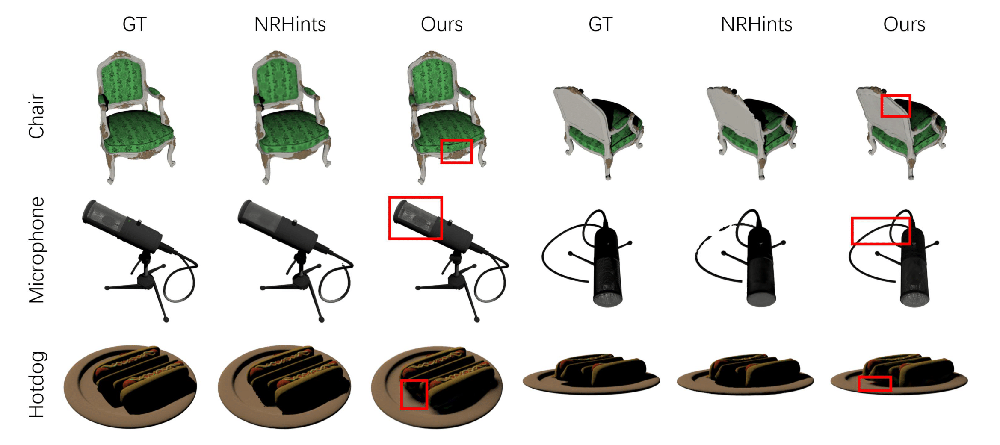
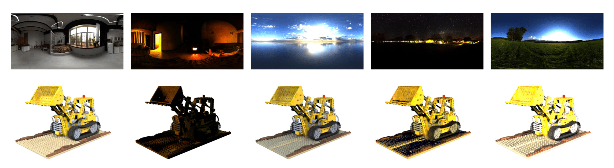

<div align="center">
<h2>PRTGaussian: Efficient Relighting Using 3D Gaussians with Precomputed Radiance Transfer</h2>

[**Libo Zhang**](https://zhanglbthu.github.io/) · [**Yuxuan Han**](https://yxuhan.github.io/) · [**Wenbin Lin**](https://wenbin-lin.github.io/) · [**Jingwang Ling**](https://gerwang.github.io/) · [**Feng Xu**](http://xufeng.site/)

Tsinghua University

</div>

### [Paper](https://www.arxiv.org/abs/2408.05631) | [Dataset](https://drive.google.com/drive/folders/1j4YlmIpuZZjyrXb4QxSI86ZgrIfP6mCr?usp=drive_link)
### Abstract
We present PRTGaussian, a realtime relightable novel-view synthesis method made possible by combining 3D Gaussians and Precomputed Radiance Transfer (PRT). 
By fitting relightable Gaussians to multi-view OLAT data, our method enables real-time, free-viewpoint relighting. 
By estimating the radiance transfer based on high-order spherical harmonics, we achieve a balance between capturing detailed relighting effects and maintaining computational efficiency. 
We utilize a two-stage process: in the first stage, we reconstruct a coarse geometry of the object from multi-view images. In the second stage, we initialize 3D Gaussians with the obtained point cloud, then simultaneously refine the coarse geometry and learn the light transport for each Gaussian. 
Extensive experiments on synthetic datasets show that our approach can achieve fast and high-quality relighting for general objects. Code and data are available at this https URL.

### Pipeline


### Results
**Comparisons**
<div align="center">
    
</div>

**Qualitative results**
<div align="center">
    
</div>


## Usage

### Setup

```bash
git clone git@github.com:zhanglbthu/Light-Transport-Gaussian.git
cd Light-Transport-Gaussian
conda create -n LTG python=3.7
conda activate LTG
pip install -r requirements.txt
```

### Dataset
We train the model using a dataset in the form of **LIGHT STAGE**, where the information about the camera and light source is known, specifically, the object is NeRF synthetic data and the light source is directional light.
You can download the generated dataset form [here](https://drive.google.com/drive/folders/1j4YlmIpuZZjyrXb4QxSI86ZgrIfP6mCr?usp=drive_link).
### Preprocess your own dataset
You can also preprocess your own dataset by following the steps below:
1. Download the data preprocessing code from [here](https://drive.google.com/drive/folders/1AiOE_F0imYrxqABN2BVy4On0BxnjbDgV?usp=sharing).
2. Modify the data configuration file `config/data.ini` to fit your own dataset.
3. Modify and run the bash script `bash/get_data.sh` 
### Train
You can download our trained model from [here](https://drive.google.com/drive/folders/1g4r1g_39yXL071Co9uQ7fgqEPaHgfO8B?usp=drive_link).
You can also train your own model by following the steps below:

First, modify the training configuration file `config/optimize.ini` to fit your own dataset.

**Arguments**:
- `root_path`: the root path of the dataset.
- `obj_name`: the name of the object.
- `out_name`: the name of the output folder.
- `data_type`: the type of the dataset, `NeRF` or `OpenIllumination`.

Then, run the training script:
```bash
bash bash/run_single.bash
```
### Test
We provide scripts for testing the relighting results of the trained model on the test set.
Similarly, modify the testing configuration file `config/evaluate.ini` and run the testing script:
```bash
bash bash/eval.bash
```
